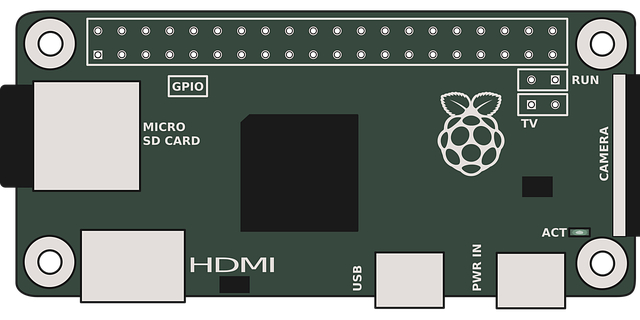

<h2> Hello, I'm Daniil Rose! </h2>

<p>
    <em>Systems Engineering Intern - Defense Mission Systems (BU)</br>
        B.S. in Computer Engineering and B.S. in German at Penn State</br>
        FSF Associate Member - EFF Member
    </em>
</p>

### For a bit more detail...

```rust
let daniil_rose = Engineer {
  main_languages: ["Rust", "C/C++", "Python"],
  hobby_languages: ["Kotlin", "Java", "Bash", "Go", "Emacs Lisp", "Zig"],
  tools: ["Docker", "SQL", "Tensorflow", "Nginx", "Pandas"],
  work: ["Designing an Apple I emulator!"],
};
```
